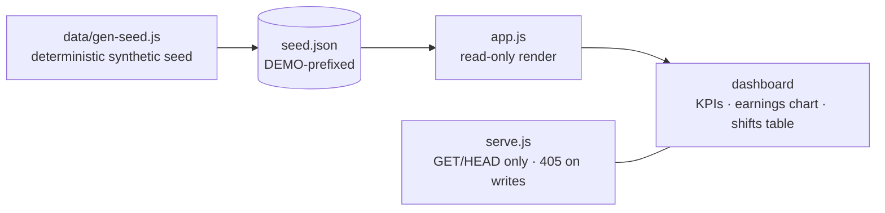

# medtrack-demo — a read-only demo of a production healthcare SaaS

> ⚠️ Sanitized portfolio demo. **MedTrack** is a real healthcare SaaS I build and run in
> production (physicians tracking shifts + earnings). This demo is **read-only** and runs
> on **100% synthetic data** — a fictional physician, fictional hospitals and shifts. No
> real patient or user data, no credentials, no production code.

A tiny, self-contained view of what MedTrack does: a physician's **shifts** and
**earnings** dashboard. It exists so the product's shape is visible without exposing
anything real — the live product protects **77 real users**.

---

## Why it's read-only by design

A public demo of a healthcare product must not be able to leak or mutate anything:

- The data is a **synthetic seed** generated by code (`data/gen-seed.js`, fixed seed).
  Every id is prefixed `DEMO`; the doctor and hospitals are invented.
- The UI (`app.js`) only **reads** `seed.json` and paints — no forms that persist, no
  network mutations.
- The bundled static server refuses any method other than `GET`/`HEAD` (**405**) and
  blocks path traversal — so even the transport is read-only.
- A persistent **"synthetic data"** banner is shown at all times.

## Architecture



## What's in the repo

```
medtrack-demo/
├── index.html        # dashboard shell + synthetic-data banner
├── styles.css        # dark, mobile-first styling
├── app.js            # read-only renderer (fetch seed.json → paint)
├── serve.js          # zero-dep static server; refuses non-GET (405)
└── data/
    ├── gen-seed.js   # deterministic synthetic seed generator
    └── seed.json     # generated: fictional physician, 71 shifts, 6 months
```

## Run it

```bash
git clone <this-repo> && cd medtrack-demo
node data/gen-seed.js     # (re)generate the synthetic seed
node serve.js             # http://localhost:5180
```

Or deploy the folder to GitHub Pages / any static host — it's just HTML/CSS/JS + a JSON.

## Results

- Renders **71** synthetic shifts across **6** months (≈€28k synthetic gross) with KPIs,
  an earnings-by-month chart, and a status-tagged shifts table.
- **Read-only verified**: server returns **405** on `POST`, **404/403** on traversal.
- Fully **reproducible** (fixed PRNG seed) and dependency-free.

## Stack

Plain HTML/CSS/JS · a zero-dependency Node static server · a deterministic seed generator.

## Notes on sanitization

MedTrack is named because it's my own product. Everything shown is synthetic: no patient
data, no real physician, no credentials, and none of the production frontend/backend. The
demo is intentionally a thin read-only shell over a generated seed.
